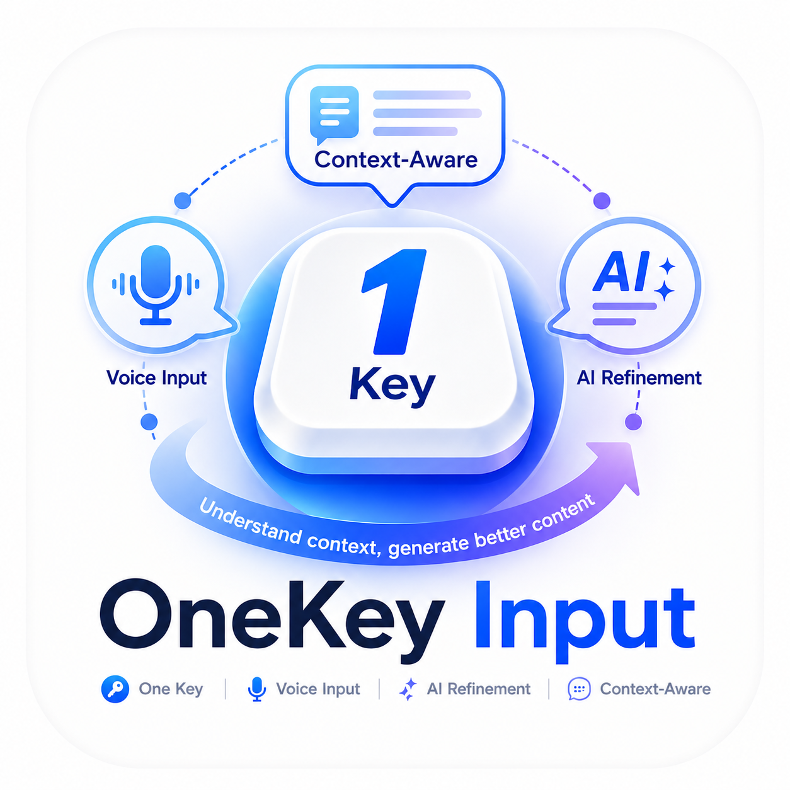

<div align="center">
  

  # One-Key Input

  **Hold a key. Speak. Context-aware AI polish. Typed at your cursor.**

  [中文](README.md) · [Quick Start](#quick-start) · [Download](https://github.com/zwcih/one-key-input/releases) · [Issues](https://github.com/zwcih/one-key-input/issues) · [Discussions](https://github.com/zwcih/one-key-input/discussions)

  <sub>Hold a hotkey · speak · release · the polished result is typed at your cursor</sub>
</div>

---

## What it is

Hold a key (default **F9**), speak, release. Then:

1. Your speech is recognized in real-time
2. An LLM polishes it in the style you picked (drop fillers / rewrite formally / leave as-is)
3. The result is injected at the focused text cursor — chat box, IDE, address bar, **almost any app**

You never open the app. You never switch windows. You never copy-paste. Your flow doesn't break.

> Demo screenshot coming soon: `assets/demo-placeholder.png`

## Why another one

Most voice-input tools either:

- **Don't polish** — you get "um", "uh", "like" verbatim and clean up later
- **Polish without any context** — your spoken "open paren" lands as the word, not `(`, when you're coding; your email comes out too casual; your forum reply sounds like an essay
- **Need window switches or cloud clipboards** — clunky flow

One-Key Input tries to be:

- **Hold-to-talk, release-to-type** — one key, zero extra steps
- **Context-aware** — the core differentiator (see below)
- **Backend-pluggable** — ASR and LLM are interfaces. Today: Azure Speech + Azure OpenAI. On the roadmap: local Whisper, local LLM
- **Cross-platform ambition** — currently Windows-native, but the abstraction layers exist for Linux/macOS later

## Context-aware — what that actually means

Most dictation tools only see *what you said*. One-Key Input also looks at *what you're looking at and replying to*, so the polished output actually fits the situation:

- Watching a **YouTube / Bilibili** video, about to comment: the title + description + currently-playing caption are part of the context — say "interesting take" and you get a reply that engages with the video, not a generic "this is interesting"
- In a **Slack / Teams / WeChat** thread: the last few messages of the conversation come along — "ok I'll take a look" gets polished as a reply to the question someone just asked, not as an isolated sentence
- In a **code editor**: the function around your cursor + the file's language — "add error handling" comes out in that language's idioms, with the right symbols
- In an **email draft**: the subject + the message you're replying to — the salutation and formality match the recipient
- In a **forum / Reddit thread**: the post title + the comment you're replying to — your response stays on topic instead of restating what you said

You say the same sentence. What changes is that the LLM polishing it actually **knows the situation you're speaking in**, so the result reads like something a collaborator who's been watching over your shoulder would write — not like a blind assistant who just rephrased your words.

> **How it does this**: the moment you press the hotkey, Core takes a time-bounded (800ms budget) UIAutomation snapshot of the foreground window — app name, window title, focused control type, ~200 chars before / ~50 after the caret, current selection, and other visible text regions in the same window (chat history, document body, etc.). This gets compressed into a short context block appended to the LLM's system prompt; what you said stays verbatim in the user message. The recording and the context capture run in parallel, so there's no added latency.
>
> Don't want it? Set `polish.use_context` to `false` in `config.json` and it's fully disabled — the UIA call won't even fire.
>
> **Current limits**: UIA reads native Win32 / WinUI / WPF apps best. For Electron and in-browser content the depth depends on whether the app exposes a full a11y tree. Dedicated adapters for browsers and major IM clients are on the roadmap.

## Quick Start

### 1. Download

Grab `OneKeyInput-x.y.z-portable.zip` from the [Releases](https://github.com/zwcih/one-key-input/releases) page. Extract anywhere.

> About 25 MB. Portable, no installer.

> ⚠️ **First launch: Windows will block it once**  
> The exe isn't code-signed (signing certs cost $200+/yr — not worth it for an unpaid open-source v0.1), so SmartScreen pops a blue **"Windows protected your PC"** dialog. Click **More info → Run anyway**. This is not malware detection — Windows just hasn't seen the file enough times to trust it yet.  
> One-time fix: before extracting, right-click the zip → **Properties → check "Unblock" → OK**. The exes inside won't carry the "downloaded from internet" mark.
>
> Or [build it yourself](#development) — locally-built exes don't get blocked.

### 2. First run

Double-click `onekey-core.exe`:
- If there's no `config.json`, the settings window opens automatically
- Fill in your Azure Speech key + region, plus your polish LLM key / endpoint
- Click **"Save and start"** — Settings probes the real upstream endpoints first and only writes the file if every credential is accepted

### 3. Use it

Hold **F9** → speak → release → text appears at the cursor.

Right-click the tray icon for:
- **Settings** — reopen configuration
- **Pause / Resume** — toggle the hotkey
- **Polish mode** — Raw (no polish) / Tidy (default) / Formal (rewrite)
- **Open Log Folder** — for when things go wrong

### 4. Editing config directly

Editing `config.json` by hand works too — Core watches the file and self-restarts on save. (Note: the GUI's pre-save credential validation is bypassed when you edit by hand.)

## Translation mode (F8)

In addition to "hold F9 = record + polish", a second hotkey is available: "hold F8 = record + translate".

Hold **F8**, speak in your native language, release → the target-language version appears at the cursor. **Reuses the same ASR, context capture, and injection pipeline** — only the LLM prompt is swapped for a structured translator prompt.

- **No "direction" concept**: you only configure a **target language**. Translation triggers when the ASR-recognized language differs from the target.
  - Target = English → Chinese gets translated, English passes through
  - Target = Chinese → English gets translated, Chinese passes through
- **Polish style carries over**: Raw / Tidy / Formal applies to translation output too. Raw translates literally; Formal produces business-grade output. Translation has no separate style ladder.
- **Context still helps**: code symbols, product names, and @handles harvested from the focused window are passed as `[KEEP VERBATIM]` so they're preserved untranslated. The other party's register also influences the reply's tone.
- **Smart target language (experimental, off by default)**: `translate.smart_target = true` derives the target from the focused window's content. **May be wrong; for consistent behavior leave this off and pin `target_language`.**

The corresponding `config.json` block:

```jsonc
{
  "translate": {
    "enabled": true,
    "hotkey": "f8",
    "min_hold_ms": 250,
    "target_language": "en",   // en/zh/ja/ko/de/fr/es/it/pt/ru ...
    "smart_target": false
  }
}
```

Or edit it from the Settings UI's "Translation Mode" section.

## Supported backends

| Kind | Provider | Status |
|---|---|---|
| ASR (streaming) | Azure Speech | ✅ default |
| ASR (REST) | Azure Speech | ✅ |
| ASR (local) | sherpa-onnx + Paraformer-zh | 🚧 interface ready ([privacy-mode roadmap](docs/privacy-mode.md)) |
| Polish | Azure OpenAI | ✅ default |
| Polish | OpenAI | ✅ |
| Polish | local LLM (llama.cpp + Qwen2.5) | 🚧 interface ready ([privacy-mode roadmap](docs/privacy-mode.md)) |

> **Privacy mode (cloud / local / hybrid)** — set the top-level `"privacy": { "mode": "cloud" }` field in `config.json` to one of `cloud` / `local` / `hybrid`. Defaults to `cloud` (no behavior change). Full design, model selection rationale, and the NPU rollout plan live in [docs/privacy-mode.md](docs/privacy-mode.md).

## What you need

- **Windows 10/11 (x64)**
- **An Azure Speech resource** — the free tier (5 hours/month) covers normal daily use
- **An LLM endpoint**:
  - Azure OpenAI: any deployment, `gpt-4o-mini` recommended (cheap + fast)
  - or an OpenAI API key

> Running it for personal use usually costs under $2/month.

## How it works

```
F9 down  → WASAPI captures mic (16 kHz mono)
         → Azure Speech streaming recognition
F9 up    → wait for final transcription
         → LLM polishes in the chosen mode (streamed)
         → SendInput / clipboard injects at the focused window
         → sound cues + tray tooltip + toast reflect state
```

Detailed architecture docs coming soon.

## Privacy

- **Local-first**: all audio and text are processed on your machine and sent **directly** to your own Azure / OpenAI account. There is no server, no telemetry, no tracking
- **Your own keys**: every cloud credential is yours; stored in `config.json` (local, gitignored)
- **Logs**: plain text under local `logs/`. Delete anytime

## Development

```bash
# Prereqs: Visual Studio 2022 Build Tools, vcpkg, Node 20+
git clone https://github.com/zwcih/one-key-input.git
cd one-key-input

# Build core
scripts\build.bat

# Build settings UI
cd settings && npm install && npm run tauri build
```

## Feedback

- 🐛 [File an issue](https://github.com/zwcih/one-key-input/issues/new/choose)
- 💡 [Discussions](https://github.com/zwcih/one-key-input/discussions) for ideas / questions
- ⭐ A star helps if it's useful

## License

[MIT](LICENSE) © 2026 zwcih
